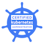

## Profile    
A highly motivated software engineer with over 10 years' experience working for a global software consultancy on a variety of large scale projects. Highly driven with proven experience in leading diverse teams on complex solutions.

Well-versed in a variety of technologies and frameworks, including both server and client-side development, with an emphasis on well architected, cloud oriented solutions. 

Holds a strong belief for high quality software, built following standardised patterns and principles and core software development processes. Excellent team player, with a strong ability to lead and get the best out of agile scrum teams.

Passionate about learning and strongly believes in building learning frameworks to ensure the right pathways are in place to create the engineers of the future.

## Professional Experience
  Senior Software Engineer - Capgemini, UK 
  *2011 - Present*
  
  - Technical lead across multiple transformation teams moving from legacy kit to cloud architected solutions
  - Led multiple scrum teams on large scale enterprise solutions
  - SME for Kubernetes and containerisation
  - Multiple successful deliveries on a range of projects, from large scale legacy EE applications, through to microservices
  - Has led a series of ‘Learn React’ sessions to help build a front-end capability  
  - Has helped lead initiatives on building learning frameworks and pathways
  - Blog contributor and knowledge sharer
  - Reviewer/mentor to other engineers        

## Education
  BSc Digital & Technology Solutions – Software Engineering 
  *Aston University - 2014-2017 - 1st Class Honours*

## Core Experience 

  - 10+ years’ experience in JVM/Open Source development and associated technologies  
  - Wealth of experience of a range of architectural styles, from JavaEE to RESTful Microservices
  - SME in Kubernetes and containerisation
  - Strong front end skills with emphasis on JavaScript and ReactJS 
  - Highly experienced in building and using CI/CD pipelines
  - Strong advocate of clean code
  - Strong technical leadership in Agile scrum teams  

## Core Skills
  - Languages - Java 11+, Kotlin, JavaScript
  - Frameworks - Spring Boot, Micronaut
  - Front End - React
  - Protocols - REST
  - Build Tools - Maven, Gradle
  - CI/CD - Jenkins, Bamboo, Gitlab Pipelines, Github Actions
  - Monitoring Tools - Grafana, Prometheus, ELK
  - Version Control - Git (tooling: GitHub, Bitbucket, Gitlab)
  - Containerisation - Kubernetes, Docker
  - Cloud Platforms - AWS, Google Cloud

## Blog Posts
    
  Below are some of blog posts I've written across varying topics.
   
  - [The Engineering Collective](https://medium.com/@greg-wolverson/the-engineering-collective-455410f8425e)

  - [Externalising Spring Boot Configuration with Kubernetes](https://greg-wolverson.medium.com/externalizing-spring-boot-config-with-kubernetes-87b5258897aa)
  
  - [Securing Spring Boot Config with Kubernetes](https://greg-wolverson.medium.com/securing-spring-boot-config-with-kubernetes-dbd57e652780)

  - [Out of the Comfort Zone and into the Classroom](https://medium.com/@greg-wolverson/out-of-the-comfort-zone-and-into-the-classroom-6da9c5801994)
 
  - [Embracing the Legacy](https://medium.com/@greg-wolverson/embracing-the-legacy-26857621a68f)
    
  - [Security of the Future](https://medium.com/capgemini-engineering/security-of-the-future-9ed27a42bd5a)
    
  - [React-ing to change](https://medium.com/capgemini-engineering/react-ing-to-change-5bbd673e0705)

## Professional Certifications  
  
   &nbsp;&nbsp;&nbsp;&nbsp;
   
   
